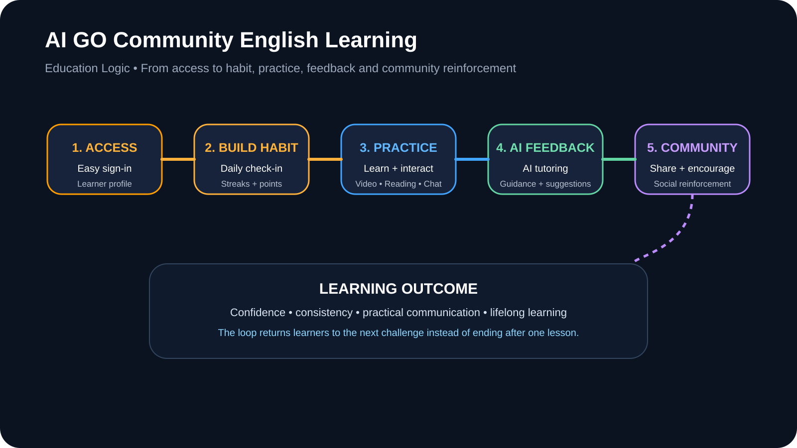

# 🌏 AI GO Community English Learning

> **English Learning Circle** — an AI-enhanced social learning environment for practical English practice, community interaction, and lifelong learning.

[](https://english-learning-circle.vercel.app/) [](https://github.com/ALLENYEUNG365/AI-GO-Community-English-Learning) [](https://drive.google.com/file/d/1RdD4iRmQR85VftlRqbCIK5RDnHvn5iI4/view?usp=sharing)

---

## ✨ Overview

**AI GO Community English Learning** is a community-oriented English learning platform built around one simple idea: language development becomes stronger when **practice, feedback, motivation, and social interaction** happen in the same learning ecosystem.

The project grows from the **English Learning Circle** concept and is designed for vocational education students, international learners, English teachers, and lifelong learners.

## 🚀 Try the Live Prototype

**Live website:** [english-learning-circle.vercel.app](https://english-learning-circle.vercel.app/)

Open the deployed prototype in a modern browser to explore the current experience.

> The live prototype is the current deployed product experience; this repository is the source and documentation hub.

---

## 🎯 The Problem

Language-learning tools often separate **content**, **practice**, **motivation**, and **community** into different experiences. AI GO Community English Learning proposes a connected model:

```text
LEARN
  ↓
PRACTICE
  ↓
GET AI / COMMUNITY FEEDBACK
  ↓
SHARE & REFLECT
  ↓
EARN PROGRESS / REINFORCEMENT
  ↓
RETURN TO LEARN
```


The goal is not simply to add AI to a language app, but to create a **repeatable learning loop** that makes English practice more accessible, social, and sustainable.

---

## 🧠 Educational Logic

**Access → Practice → Feedback → Social Reinforcement → Continued Learning**



The model connects easy access, habit-building, structured learning, AI assistance, community reinforcement, and continued progress.


---

## 🏗️ Product / Technology Architecture


The documented stack includes:

- **Framework:** Next.js 14
- **Language:** TypeScript
- **Styling:** Tailwind CSS
- **Database:** PostgreSQL via Supabase
- **ORM:** Prisma
- **Authentication:** NextAuth.js / Google OAuth
- **File storage:** Cloudinary
- **Theme:** next-themes

---

## 🧩 Core Features

- ✅ Google OAuth Login
- ✅ Daily Check-in System
- ✅ Points & Rewards
- ✅ Share Text, Images, Videos
- ✅ AI Chat Assistant
- ✅ Learning Hub
- ✅ Dark / Light Theme
- ✅ Responsive Design

Advanced AI functions are presented separately as a roadmap rather than as completed features.

---

## 🖼️ Product Preview

### Product concept / learning space


### Home dashboard


### Daily Check-in / community engagement


### Community-Based Learning / onboarding logic


### Learning Hub / progress tracking


### AI English learning assistant


---

## 🎬 Demo Video

[▶ Watch the AI GO Community English Learning demo](https://drive.google.com/file/d/1RdD4iRmQR85VftLrQbCIK5RDnHvn5iI4/view)

Keep the Google Drive permission set to **Anyone with the link can view** so reviewers can access the video without signing in.

---

## 📚 Educational Use Cases

### Vocational Education
Support practical English communication for study, work, and career-oriented contexts.

### International Learners
Support learners preparing for academic, professional, and cross-cultural communication.

### Educators
Provide a community-oriented space for learning resources, participation, and future AI-assisted teaching support.

### Lifelong Learning
Encourage consistent, low-friction practice through habit-building and community reinforcement.

---

## 🤖 Responsible AI Roadmap

Future exploration includes:

- AI Grammar Correction and Writing Feedback
- AI Vocabulary Coach and Personalized Learning Paths
- AI Conversation Practice
- AI-generated Learning Exercises and Assessments
- AI-powered Learning Recommendations
- AI-assisted Teaching Resources for Educators
- Learning Analytics and Progress Tracking
- Multilingual Learning Support

---

## 🌱 Vision

> **Make English learning more accessible, social, personalized, and sustainable through responsible AI and community-driven learning.**

---

## 👤 Project Story

AI GO Community English Learning grows from the **English Learning Circle** concept: learning English is not only about completing lessons, but also about building confidence, practicing consistently, exchanging ideas, and learning with other people.

🔗 [English Learning Circle: AI-Powered Community English Learning for Vocational Education](https://www.linkedin.com/pulse/english-learning-circle-ai-powered-community-vocational-xinlin-yang-96imc/)

---

## 💻 Quick Start

```bash
npm install
npm run dev
```

Then open `http://localhost:3000`.

---

## 📁 Repository Structure

```text
AI-GO-Community-English-Learning/
├── app/
├── components/
├── prisma/
├── docs/
│   ├── education-logic.svg
│   ├── learning-loop.svg
│   ├── architecture.svg
│   └── screenshots/
├── README.md
└── package.json
```

---

## 📄 License

MIT
