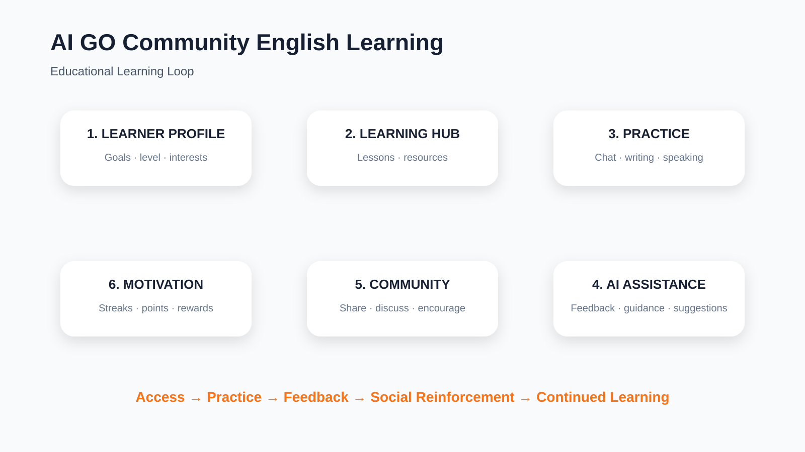

# 🌏 AI GO Community English Learning

> **English Learning Circle** — an AI-enhanced social learning environment for practical English practice, community interaction, and lifelong learning.

[](https://english-learning-circle.vercel.app/) [](https://github.com/ALLENYEUNG365/AI-GO-Community-English-Learning) [](https://drive.google.com/file/d/1RdD4iRmQR85VftlRqbCIK5RDnHvn5iI4/view?usp=sharing)

---

## ✨ Overview

**AI GO Community English Learning** is a community-oriented English learning platform built around one simple idea: language development becomes stronger when **practice, feedback, motivation, and social interaction** happen in the same learning ecosystem.

The project grows from the **English Learning Circle** concept and is designed for:

- vocational education students
- international learners
- English teachers
- lifelong learners

The current project documentation emphasizes accessible, collaborative, and responsible AI-enhanced language education.

## 🚀 Try the Live Prototype

**Live website:** [english-learning-circle.vercel.app](https://english-learning-circle.vercel.app/)

Open the deployed prototype in a modern browser to explore the current experience.

> **Important:** the live prototype is the current deployed product experience. The GitHub repository is the source and documentation hub.

---

## 🎯 The Problem

Language-learning tools often separate **content**, **practice**, **motivation**, and **community** into different experiences. Learners may study vocabulary in one place, practice conversation somewhere else, and depend on external communities for encouragement.

AI GO Community English Learning proposes a connected model:

```text
LEARN
  ↓
PRACTICE
  ↓
GET AI / COMMUNITY FEEDBACK
  ↓
SHARE & REFLECT
  ↓
EARN PROGRESS / REINFORCEMENT
  ↓
RETURN TO LEARN
```

The goal is not simply to add AI to a language app. It is to create a **repeatable learning loop** that makes English practice more accessible, social, and sustainable.

---

## 🧠 Educational Logic

The learning model is organized as:

**Access → Practice → Feedback → Social Reinforcement → Continued Learning**



### How the loop works

1. **Learner Profile** — goals, level, and interests provide the context for learning.
2. **Learning Hub** — structured resources support targeted study.
3. **Practice** — learners apply English through chat, writing, speaking, and interaction.
4. **AI Assistance** — the platform explores assistive feedback, guidance, clarification, and recommendations.
5. **Community** — sharing, discussion, and encouragement reinforce learning.
6. **Motivation & Progress** — streaks, points, and rewards help sustain engagement.

This framing is consistent with the project's documented educational intent and AI roadmap.

---

## 🏗️ Product / Technology Architecture


The current repository documents the following stack:

- **Framework:** Next.js 14
- **Language:** TypeScript
- **Styling:** Tailwind CSS
- **Database:** PostgreSQL via Supabase
- **ORM:** Prisma
- **Authentication:** NextAuth.js / Google OAuth
- **File storage:** Cloudinary
- **Theme:** next-themes

The architecture diagram is a presentation-oriented view of these documented components; it does not imply additional production infrastructure beyond what is currently documented.

---

## 🧩 Core Features

The current repository documentation lists:

- ✅ Google OAuth Login
- ✅ Daily Check-in System
- ✅ Points & Rewards
- ✅ Share Text, Images, Videos
- ✅ AI Chat Assistant
- ✅ Learning Hub
- ✅ Dark / Light Theme
- ✅ Responsive Design

These are presented as the current feature set; more advanced AI capabilities are documented as future exploration rather than silently treated as completed functionality.

---

## 🖼️ Product Preview

The repository is intended to showcase the strongest user-facing flows through real screenshots.

### Home / Learning Experience


### AI Assistant


### Learning Hub


### Learner Profile / Progress


> Add the four real screenshots under `docs/screenshots/` using these exact filenames. Until those files are uploaded, GitHub will show the image links as unavailable.

---

## 🎬 Demo Video

### Product walkthrough

[▶ Watch the AI GO Community English Learning demo](https://drive.google.com/file/d/1RdD4iRmQR85VftlRqbCIK5RDnHvn5iI4/view?usp=sharing)

The submitted demo video is hosted on Google Drive. Make sure the sharing permission remains **Anyone with the link can view**, so reviewers can access it without signing in.

---

## 📚 Educational Use Cases

### Vocational Education

Support practical English communication for study, work, and career-oriented contexts.

### International Learners

Support learners preparing for academic, professional, and cross-cultural communication.

### Educators

Create a community-oriented space for learning resources, participation, and future AI-assisted teaching support.

### Lifelong Learning

Encourage consistent, low-friction practice through habit-building and community reinforcement.

---

## 🤖 Responsible AI Roadmap

The current documentation frames AI as an **assistive learning layer** and outlines future exploration in:

- AI Grammar Correction and Writing Feedback
- AI Vocabulary Coach and Personalized Learning Paths
- AI Conversation Practice
- AI-generated Learning Exercises and Assessments
- AI-powered Learning Recommendations
- AI-assisted Teaching Resources for Educators
- Learning Analytics and Progress Tracking
- Multilingual Learning Support

These items are roadmap directions, not claims that every feature is already implemented.

---

## 🌱 Vision

> **Make English learning more accessible, social, personalized, and sustainable through responsible AI and community-driven learning.**

The project's documented long-term vision is an open and accessible AI-enhanced learning ecosystem for students, educators, and lifelong learners.

---

## 👤 Project Story

AI GO Community English Learning grows from the **English Learning Circle** concept: learning English is not only about completing lessons, but also about building confidence, practicing consistently, exchanging ideas, and learning with other people.

For the broader project story and educational positioning, see the related article:

🔗 [English Learning Circle: AI-Powered Community English Learning for Vocational Education](https://www.linkedin.com/pulse/english-learning-circle-ai-powered-community-vocational-xinlin-yang-96imc/)

> **Reference note:** the LinkedIn article is included as project context. Details not documented in this repository should be read from the article itself rather than assumed here.

---

## 💻 Quick Start

```bash
npm install
npm run dev
```

Then open:

```text
http://localhost:3000
```

For local authentication, database, and storage configuration, see `.env.example` and the setup documentation in the project.

---

## 📁 Repository Structure

```text
AI-GO-Community-English-Learning/
├── app/                    # Next.js application routes
├── components/             # Reusable UI components
├── prisma/                 # Database schema and ORM layer
├── docs/                   # Documentation and presentation assets
│   ├── learning-loop.svg   # Educational logic diagram
│   ├── architecture.svg    # Technology architecture diagram
│   └── screenshots/         # Product screenshots
├── README.md               # Project documentation
└── package.json            # Dependencies and scripts
```

---

## 📄 License

MIT
